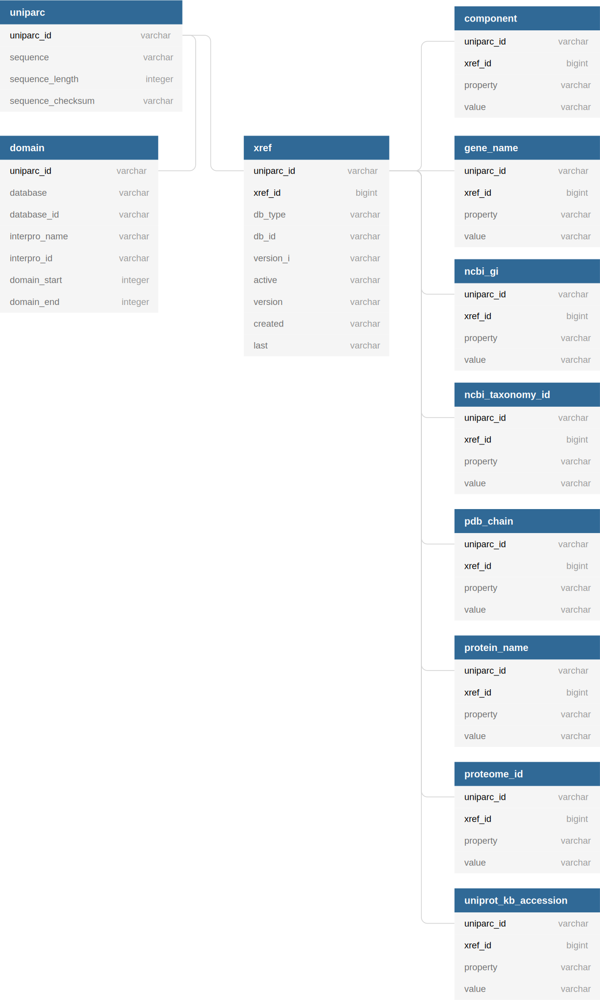

# UniParc XML parser

Process the UniParc XML file (`uniparc_all.xml.gz`) downloaded from the UniProt [website](http://www.uniprot.org/downloads) into CSV files that can be loaded into a relational database.

## Usage

Uncompressed XML data can be piped into `uniparc_xml_parser` in order to

```bash
$ curl -sS ftp://ftp.uniprot.org/pub/databases/uniprot/current_release/uniparc/uniparc_all.xml.gz \
    | zcat \
    | uniparc_xml_parser
```

The output is a set of CSV (or more specifically TSV) files:

```bash
$ ls
component.tsv  gene_name.tsv  ncbi_taxonomy_id.tsv  protein_name.tsv  uniparc.tsv               xref.tsv
domain.tsv     ncbi_gi.tsv    pdb_chain.tsv         proteome_id.tsv   uniprot_kb_accession.tsv
```

## Schema

The generated CSV files conform to the following schema:

<div align="center">

</div>

## Benchmarks

Parsing 10,000 XML entires takes around 30 seconds (the process is mostly IO-bound):

```bash
$ time bash -c "zcat uniparc_top_10k.xml.gz | uniparc_xml_parser >/dev/null"

real    0m33.925s
user    0m36.800s
sys     0m1.892s
```

The actual `uniparc_all.xml.gz` file has around 373,914,570 elements.

## FAQ (Frequently Asked Questions)

**Why not split `uniparc_all.xml.gz` into multiple small files and process them in parallel?**

- Splitting the file requires reading the entire file. If we're reading the entire file anyway, why not parse it as we read it?
- Having a single process which parses `uniparc_all.xml.gz` makes it easier to create an incremental unique index column (e.g. `xref.xref_id`).

## FUQ (Frequently Used Queries)

TODO

## Roadmap

- [ ] Keep everything in bytes all the way until output.
