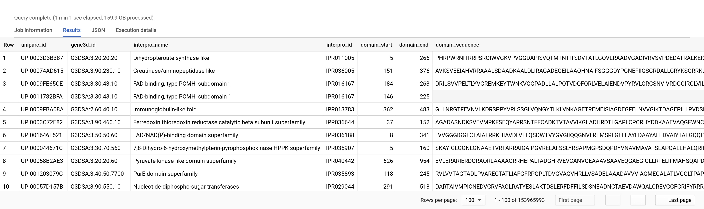

# UniParc XML parser <!-- omit in toc -->

[](https://ostrokach.gitlab.io/uniparc_xml_parser/v0.2.1/)
[](https://crates.io/crates/uniparc_xml_parser/)
[](https://anaconda.org/ostrokach-forge/uniparc_xml_parser/)
[](https://gitlab.com/ostrokach/uniparc_xml_parser/commits/v0.2.1/)

- [Introduction](#introduction)
- [Usage](#usage)
- [Table schema](#table-schema)
- [Installation](#installation)
  - [Binaries](#binaries)
  - [Cargo](#cargo)
  - [Conda](#conda)
- [Output files](#output-files)
  - [Parquet](#parquet)
  - [Google BigQuery](#google-bigquery)
- [Benchmarks](#benchmarks)
- [Example SQL queries](#example-sql-queries)
  - [Find and extract all Gene3D domain sequences](#find-and-extract-all-gene3d-domain-sequences)
  - [Find and extract all _unique_ Gene3D domain sequences](#find-and-extract-all-unique-gene3d-domain-sequences)
  - [Map Ensembl identifiers to UniProt](#map-ensembl-identifiers-to-uniprot)
  - [Find crystal structures of all GPCRs](#find-crystal-structures-of-all-gpcrs)
- [FAQ (Frequently Asked Questions)](#faq-frequently-asked-questions)
- [Roadmap](#roadmap)

## Introduction

`uniparc_xml_parser` is a small utility which can process the UniParc XML file (`uniparc_all.xml.gz`), available from the UniProt [website](http://www.uniprot.org/downloads), into a set of CSV files that can be loaded into a relational database.

We also provide Parquet files, which can be queried using tools such as AWS Athena and Apache Presto, and have uploaded the generated data to Google BigQuery (see: [Output files](#output-files)).

## Usage

Uncompressed XML data can be piped into `uniparc_xml_parser` in order to parse the data into a set of CSV files on the fly:

```bash
$ curl -sS ftp://ftp.uniprot.org/pub/databases/uniprot/current_release/uniparc/uniparc_all.xml.gz \
    | zcat \
    | uniparc_xml_parser
```

The output is a set of CSV (or more specifically TSV) files:

```bash
$ ls
-rw-r--r-- 1 user group 174G Feb  9 13:52 xref.tsv
-rw-r--r-- 1 user group 149G Feb  9 13:52 domain.tsv
-rw-r--r-- 1 user group 138G Feb  9 13:52 uniparc.tsv
-rw-r--r-- 1 user group 107G Feb  9 13:52 protein_name.tsv
-rw-r--r-- 1 user group  99G Feb  9 13:52 ncbi_taxonomy_id.tsv
-rw-r--r-- 1 user group  74G Feb  9 20:13 uniparc.parquet
-rw-r--r-- 1 user group  64G Feb  9 13:52 gene_name.tsv
-rw-r--r-- 1 user group  39G Feb  9 13:52 component.tsv
-rw-r--r-- 1 user group  32G Feb  9 13:52 proteome_id.tsv
-rw-r--r-- 1 user group  15G Feb  9 13:52 ncbi_gi.tsv
-rw-r--r-- 1 user group  21M Feb  9 13:52 pdb_chain.tsv
-rw-r--r-- 1 user group  12M Feb  9 13:52 uniprot_kb_accession.tsv
-rw-r--r-- 1 user group 656K Feb  9 04:04 uniprot_kb_accession.parquet
```

## Table schema

The generated CSV files conform to the following schema:

<div align="center">

</div>

## Installation

### Binaries

Linux binaries are available here: https://gitlab.com/ostrokach/uniparc_xml_parser/-/packages.

### Cargo

Use [`cargo`](https://crates.io/) to compile and install `uniparc_xml_parser` for your target platform:

```bash
cargo install uniparc_xml_parser
```

### Conda

Use [`conda`](https://docs.conda.io/en/latest/miniconda.html) to install precompiled binaries:

```bash
conda install -c ostrokach-forge uniparc_xml_parser
```

## Output files

### Parquet

Parquet files containing the processed data are available at the following URL and are updated monthly: <http://uniparc.data.proteinsolver.org/>.

### Google BigQuery

The latest data can also be queried directly using Google BigQuery: <https://console.cloud.google.com/bigquery?project=ostrokach-data&p=ostrokach-data&page=dataset&d=uniparc>.

## Benchmarks

Parsing 10,000 XML entires takes around 30 seconds (the process is mostly IO-bound):

```bash
$ time bash -c "zcat uniparc_top_10k.xml.gz | uniparc_xml_parser >/dev/null"

real    0m33.925s
user    0m36.800s
sys     0m1.892s
```

The actual `uniparc_all.xml.gz` file has around 373,914,570 elements.

## Example SQL queries

### Find and extract all Gene3D domain sequences

```sql
SELECT
  uniparc_id,
  database_id AS gene3d_id,
  interpro_name,
  interpro_id,
  domain_start,
  domain_end,
  SUBSTR(sequence, domain_start, domain_end - domain_start + 1) AS domain_sequence
FROM `ostrokach-data.uniparc.uniparc` u
JOIN `ostrokach-data.uniparc.domain` d
USING (uniparc_id)
WHERE d.database = 'Gene3D';
```

BigQuery: <https://console.cloud.google.com/bigquery?sq=930310419365:a29f957964174c6dbfba7caac1dfeee9>.


### Find and extract all _unique_ Gene3D domain sequences

```sql
SELECT
  ARRAY_AGG(uniparc_id ORDER BY uniparc_id, domain_start, domain_end) uniparc_id,
  ARRAY_AGG(gene3d_id ORDER BY uniparc_id, domain_start, domain_end) gene3d_id,
  ARRAY_AGG(interpro_name ORDER BY uniparc_id, domain_start, domain_end) interpro_name,
  ARRAY_AGG(interpro_id ORDER BY uniparc_id, domain_start, domain_end) interpro_id,
  ARRAY_AGG(domain_start ORDER BY uniparc_id, domain_start, domain_end) domain_start,
  ARRAY_AGG(domain_end ORDER BY uniparc_id, domain_start, domain_end) domain_end,
  domain_sequence
FROM (
  SELECT
    uniparc_id,
    database_id AS gene3d_id,
    interpro_name,
    interpro_id,
    domain_start,
    domain_end,
    SUBSTR(sequence, domain_start, domain_end - domain_start + 1) AS domain_sequence
  FROM `ostrokach-data.uniparc.uniparc` u
  JOIN `ostrokach-data.uniparc.domain` d
  USING (uniparc_id)
  WHERE d.database = 'Gene3D') t
GROUP BY
  domain_sequence;
```

BigQuery: <https://console.cloud.google.com/bigquery?sq=930310419365:f8fa36964fed48c8b187ccadcf070223>.



### Map Ensembl identifiers to UniProt

Find UniProt indentifiers for Ensembl transcript identifiers corresponding to the same sequence:

```sql
SELECT
  ensembl.db_id ensembl_id,
  uniprot.db_id uniprot_id
FROM (
  SELECT uniparc_id, db_id
  FROM `ostrokach-data.uniparc.xref`
  WHERE db_type = 'Ensembl') ensembl
JOIN (
  SELECT uniparc_id, db_id
  FROM `ostrokach-data.uniparc.xref`
  WHERE db_type = 'UniProtKB/Swiss-Prot') uniprot
USING (uniparc_id);
```

BigQuery: <https://console.cloud.google.com/bigquery?sq=930310419365:488eace5d1524ba8bdc049935ba09251>.


### Find crystal structures of all GPCRs

```sql
SELECT
  uniparc_id,
  SUBSTR(p.value, 1, 4) pdb_id,
  SUBSTR(p.value, 5) pdb_chain,
  d.database_id pfam_id,
  d.domain_start,
  d.domain_end,
  u.sequence pdb_chain_sequence
FROM `ostrokach-data.uniparc.uniparc` u
JOIN `ostrokach-data.uniparc.domain` d USING (uniparc_id)
JOIN `ostrokach-data.uniparc.pdb_chain` p USING (uniparc_id)
WHERE d.database = 'Pfam'
AND d.database_id = 'PF00001';
```

BigQuery: <https://console.cloud.google.com/bigquery?sq=930310419365:8df5c3ad12144f418b0e1bc1285befc4>.


## FAQ (Frequently Asked Questions)

**Why not split `uniparc_all.xml.gz` into multiple small files and process them in parallel?**

- Splitting the file requires reading the entire file. If we're reading the entire file anyway, why not parse it as we read it?
- Having a single process which parses `uniparc_all.xml.gz` makes it easier to create an incremental unique index column (e.g. `xref.xref_id`).

## Roadmap

- [ ] Add support for writing Apache Parquet files directly.
- [ ] Add support for writing output to object stores (such as S3 and GCS).
- [ ] Avoid decoding the input into strings (keep everything as bytes throughout).
